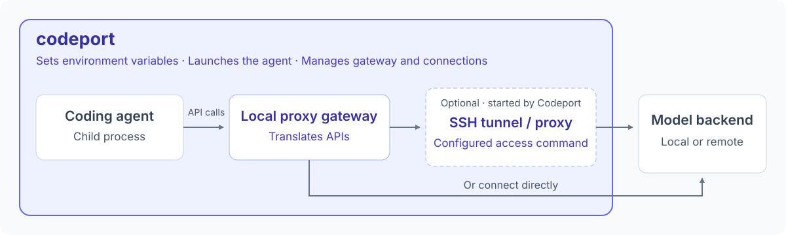

# codeport



Run your preferred coding agent against your own model backend. Codeport handles API translation and can start an SSH tunnel or proxy before launching the agent.

Configure your backends once, then choose how to work:

| What you want to do | Command | What Codeport handles |
| --- | --- | --- |
| Code with a local model | `codeport opencode --backend local` | Connects the agent to your saved backend and model. |
| Try another agent on the same model | `codeport codex --backend local` | Adapts supported API requests to the backend's protocol. |
| Use a model on a remote GPU | `codeport opencode --backend home-gpu` | Starts the configured SSH tunnel or proxy, waits for connectivity, and cleans up on exit. |
| Try a different model for one session | `codeport opencode --model unsloth/Qwen3.8-27B-GGUF` | Overrides the model for that run without changing your saved default. |

Supported coding agents: **Pi**, **OpenCode**, **Codex (experimental)**, and **Claude Code (experimental)**.

Codex and Claude Code integrations are still under development; some tools and workflows may fail.

`local` and `home-gpu` are example backend names you create in the configuration UI. Agent sessions run in your current directory, with connection settings scoped to the launched process.

## Quick start

On Linux or macOS, use Rust 1.86 or newer and have your coding agent installed on `PATH`. From this repository:

```sh
cargo install --locked --path .
codeport -cfg
codeport opencode
```

In the configuration UI, add your backend URL, protocol, exact model ID, and credentials, then bind your agent to it. Replace `opencode` with `pi`, `codex`, or `claude` as needed. Ensure Cargo's bin directory (usually `~/.cargo/bin`) is on `PATH`.

Forward agent options after `--`, for example `codeport claude -- --continue`.

## Configuration and credentials

On both Linux and macOS, the file is:

```text
~/.config/codeport/credential.json
```

`--config PATH` selects an alternate credential file for both configuration UI and launching. Without it, the default path above is used.

```sh
codeport --config ./credential.json -cfg
codeport --config ./credential.json opencode
```

If upgrading from `launchcoder`, copy your existing
`~/.config/launchcoder/credential.json` to `~/.config/codeport/credential.json`
with directory permissions `0700` and file permissions `0600`. Alternatively,
use `codeport --config ~/.config/launchcoder/credential.json opencode` to keep
using the existing file. The configuration format is unchanged.

The file contains both configuration and credentials. Writes use an atomic replacement with file permissions `0600`; newly created configuration directories use `0700`. Existing parent directory permissions are preserved, including when using `--config`. Loading an existing regular file corrects its permissions to `0600`; a symbolic link is rejected. Credentials are plaintext, protected by filesystem permissions, and are masked in interactive password prompts.

Example configuration:

```json
{
  "backends": {
    "local": {
      "url": "http://127.0.0.1:8000/v1",
      "protocol": "chat_completions",
      "model": "my-coding-model",
      "auth": {
        "type": "bearer",
        "token": "replace-with-your-token"
      },
      "access": null
    },
    "home-gpu": {
      "url": "http://127.0.0.1:18000/v1",
      "protocol": "anthropic",
      "model": "",
      "auth": {
        "type": "basic",
        "username": "developer",
        "password": "replace-with-your-password"
      },
      "access": {
        "command": "ssh -N -o BatchMode=yes -o ExitOnForwardFailure=yes -L 127.0.0.1:18000:127.0.0.1:8000 home-gpu",
        "persistent": true,
        "cleanup": null,
        "timeout_secs": 30
      }
    }
  },
  "agents": {
    "pi": { "backend": "local", "model": null },
    "opencode": { "backend": "local", "model": null },
    "codex": { "backend": "local", "model": null },
    "claude": { "backend": "home-gpu", "model": "" }
  }
}
```

Protocol values are `chat_completions`, `responses`, and `anthropic`. Set the base URL to the API prefix expected by the server, usually ending in `/v1`, rather than a complete `/chat/completions`, `/responses`, or `/messages` endpoint.

Authentication can be `null`, a bearer token, or HTTP Basic. Only one authentication method is used per backend. Upstream credentials remain in the bridge; agents receive a separate random credential for the loopback connection.

Model precedence is CLI `--model`, agent binding, then backend default. Missing or `null` fields inherit the next default. An explicit empty string suppresses a model override and preserves the model requested by the agent. In the UI, leaving a model field blank stores `null`; leave both the binding and backend model blank to preserve the agent's selection.

Use the exact model ID advertised by your backend's `/v1/models` endpoint,
including any namespace. For example, the verified local Qwen backend requires
`unsloth/Qwen3.8-27B-GGUF`; the shortened name `Qwen3.8-27B-GGUF` returned a
model-not-found error. Save the full ID as the backend model in `codeport -cfg`,
or override it for one session:

```sh
codeport opencode --model unsloth/Qwen3.8-27B-GGUF
```

To check a configured OpenCode backend without opening the interactive UI:

```sh
codeport opencode -- run --format json 'Reply with only OK. Do not use tools or change any files.'
```

If the backend returns `401 Unauthorized`, update its authentication settings in
`codeport -cfg`. For `404` model errors, check the exact model ID and whether
the server has loaded that model or allows switching models by request.

## Backend access

The launcher gives interactive agents the foreground terminal and restores it afterward. It owns the agent's process group, forwards externally received termination signals, and terminates remaining tool subprocesses when the session ends. Any access utilities must already be installed and available on `PATH`.

Set `access` to `null` for direct access, or configure a command:

- `command` runs through `/bin/sh -c`, inherits the environment and current directory, and receives no interactive stdin. Authenticate SSH, Teleport, VPN clients, or other tools beforehand.
- `persistent: false` waits for the command to finish successfully before checking readiness.
- `persistent: true` keeps the command running during the session. Its unexpected exit stops the launched agent.
- `timeout_secs` bounds startup and readiness. The URL must be fixed; dynamically returned URLs are not supported.
- `cleanup` is an optional shell command used after a started access session, including startup failures and handled termination signals.

Readiness checks whether the configured host and port accept TCP connections. It does not validate authentication, model availability, or API behavior.

On exit, the cleanup command runs first, with a ten-second timeout. The launcher then terminates its owned persistent access process group, including descendants. Once a preparation command has exited and been reaped, the launcher no longer retains its process-group ID; use the cleanup command to stop any background service it started. Persistent commands should stay in the foreground rather than daemonizing. A cleanup error is reported without replacing the agent's exit status. Cleanup cannot run after an uncatchable process termination such as `SIGKILL`.

## Protocol compatibility

The bridge accepts OpenAI Chat Completions, OpenAI Responses, and Anthropic Messages. Same-protocol requests are forwarded to preserve native features. Cross-protocol translation targets text conversations, streamed responses, function/tool calls, and tool results used in repeated agent turns.

For cross-protocol launches, the Codex adapter disables its default reasoning and hosted web-search features, and the Claude Code adapter disables thinking; the launcher announces these compatibility settings. Same-protocol launches retain native behavior.

Translation is not complete API emulation. Opaque reasoning state, multimodal content, built-in hosted tools, and other features without a supported mapping produce explicit errors instead of silently losing data. An agent or backend that requires those features may need a matching protocol or different agent settings.

Real clients have passed local mock API smoke checks for streamed text and tool roundtrips: Codex 0.155.0 and 0.155.1, Claude Code 2.1.208, Pi 0.85.1, and OpenCode 1.18.31 and 2.0.10. OpenCode 2.0.10 has also completed a live text request against a local Unsloth backend serving `unsloth/Qwen3.8-27B-GGUF`. Codex 0.155.1 has also completed a live text request and a shell-tool roundtrip against that backend. Paid model backends have not been verified. Compatibility with other agent releases or backend implementations still needs verification.

For Codex, the bridge translates namespaced function and custom tools to unique
backend tool names and restores their namespaces in replies. Its model endpoint
also supplies Codex-compatible metadata for the configured model, using text-only
input and a conservative 32,768-token context window. This is a compatibility
default, not detection of the backend's actual limit. Override it when needed,
for example `codeport codex -- -c model_context_window=65536` if your backend
supports that context size.

With no explicit model, OpenCode preserves saved selections from its native OpenAI or Anthropic providers. Configure a model override for other provider selections.

For OpenCode 2, the launcher automatically selects `--standalone` so its private
server receives the session's local provider and model configuration. The shared
background server does not inherit these settings. OpenCode 1 retains its existing
launch behavior.

To reproduce the Pi/OpenCode checks with isolated package installation:

```sh
npm --prefix /tmp/codeport-smoke-tools install --no-save --ignore-scripts @earendil-works/pi-coding-agent@0.85.1 opencode-ai@1.18.31
cargo build --locked
python3 scripts/smoke_open_agents.py --launcher target/debug/codeport --agent-bin /tmp/codeport-smoke-tools/node_modules/.bin
```

For installed Codex and Claude Code clients, run `python3 scripts/smoke_agents.py --launcher target/debug/codeport`.

The smoke harness creates temporary per-agent configuration directories, uses fake credentials and a local streaming backend, and asks each agent to read a temporary fixture before completing. HTTP proxy settings reject external proxy requests; no upstream model credentials are inherited. Pi's current package name follows its [official installation documentation](https://github.com/earendil-works/pi/tree/main/packages/coding-agent).

## Development and platform builds

```sh
cargo test --locked
cargo clippy --locked --all-targets -- -D warnings
cargo fmt --all -- --check
python3 scripts/smoke_tui.py
```

CI runs these checks on Linux and macOS, plus an MSRV check on Rust 1.86 that also exercises `cargo install --path .` with fresh dependency resolution. Release-mode artifact jobs target:

| Platform | Rust target | Build method |
| --- | --- | --- |
| Linux x86-64 | `x86_64-unknown-linux-musl` | `cross` on Linux |
| Linux ARM64 | `aarch64-unknown-linux-musl` | `cross` on Linux |
| macOS Intel | `x86_64-apple-darwin` | Native Intel runner |
| macOS Apple Silicon | `aarch64-apple-darwin` | Native ARM64 runner |

Linux builds use musl for static binaries; a normal native Linux `cargo build` may target glibc instead. macOS builds use the native system runtime. Rustls handles outbound TLS without requiring an OpenSSL installation.

The workflow stores compressed build artifacts and does not publish releases. Its platform matrix follows the [GitHub runner reference](https://docs.github.com/en/actions/reference/runners/github-hosted-runners); Linux cross-compilation uses [actions-rust-cross](https://github.com/houseabsolute/actions-rust-cross).
